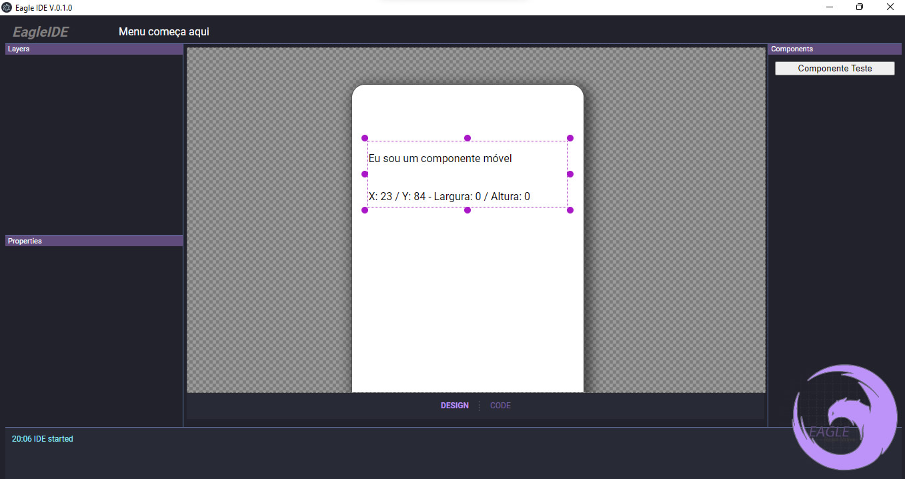

# EAGLE IDE

[](https://app.codacy.com/gh/danielmeloalencar/eagle-ide?utm_source=github.com&utm_medium=referral&utm_content=danielmeloalencar/eagle-ide&utm_campaign=Badge_Grade_Settings)

<!---Esses são exemplos. Veja https://shields.io para outras pessoas ou para personalizar este conjunto de escudos. Você pode querer incluir dependências, status do projeto e informações de licença aqui--->




> IDE Visual Para React Native com posicionamento absoluto de componentes de forma responsiva.

> Visual IDE For React Native with Responsive Absolute Component Placement
### Ajustes e melhorias

O projeto ainda está em desenvolvimento e as próximas atualizações serão voltadas nas seguintes tarefas:

- [x] Core em ReactNative para posicionamento absolunto responsivo
- [x] Layout
- [x] Canvas Pan/Zoom
- [x] Mover/Redimensionar em runtime
- [ ] Paleta de Componentes (Básica)
- [ ] Editor de Propriedades


## 💻 Pré-requisitos

Antes de começar, verifique se você atendeu aos seguintes requisitos:
<!---Estes são apenas requisitos de exemplo. Adicionar, duplicar ou remover conforme necessário--->
* `Node`
* `Git`


## 🚀 Instalando EAGLE IDE

Para instalar o Eagle IDE, siga estas etapas:

Windows / Linux:
```
$ npm install 
```


## ☕ Rodando o Eagle IDE

Para rodar o Eagle IDE, siga estas etapas:

```
npm run electron:serve
```

Para compilar o Eagle IDE, siga estas etapas:

```
npm run electron:build
```

## 📫 Contribuindo para Eagle IDE
<!---Se o seu README for longo ou se você tiver algum processo ou etapas específicas que deseja que os contribuidores sigam, considere a criação de um arquivo CONTRIBUTING.md separado--->
Para contribuir com Eagle IDE, siga estas etapas:

1. Bifurque este repositório.
2. Crie um branch: `git checkout -b <nome_branch>`.
3. Faça suas alterações e confirme-as: `git commit -m '<mensagem_commit>'`
4. Envie para o branch original: `git push origin eagle-ide / https://github.com/danielmeloalencar/eagle-ide`
5. Crie a solicitação de pull.

Como alternativa, consulte a documentação do GitHub em [como criar uma solicitação pull](https://help.github.com/en/github/collaborating-with-issues-and-pull-requests/creating-a-pull-request).

## 🤝 Colaboradores

Agradecemos às seguintes pessoas que contribuíram para este projeto:

<table>
  <tr>
      <td align="center">
      <a href="#">
        <br>
        <sub>
          <b>Daniel Melo Alencar</b>
        </sub>
      </a>
    </td>
  </tr>
</table>


## 😄 Seja um dos contribuidores<br>

Quer fazer parte desse projeto? Envie um email para danielmalencar2011@gmail.com.

